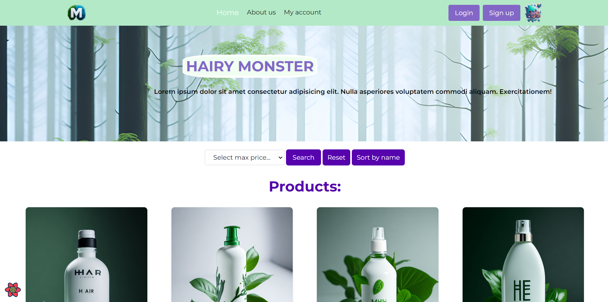

# eshop-react-node

This is my repository for practicing FullStack technologies. I practiced NodeJs, Express, JWT and MongoDB in backend folder creating a base structure of an e-shop, and I practiced ReactTs using Vite template, with Tailwind for styling, Axios for fething backend data, GSAP for animations, React Query for controlling fetched information, Zustand for managing state (simpler than Redux).

## Instructions

```bash
git clone < url >
yarn
cd < folder's project >
```

### Backend:

In this case you has to change enviroment variables and conect to you mongoDB Account, in /eshop-fe/data you can watch the basic structure of the producs data. Remember to change name .env.template file to .env.

```bash
cd < folder's project >
yarn dev
```

Sure console show you
"servidor en puerto 4000" and
"DB Online"

### Front-end:

Create a folder

```bash
cd <that folder's name>
yarn install
yarn dev
```

## Project status

MVP stage - In version 0.0.1

## License

[MIT](https://choosealicense.com/licenses/mit/)
